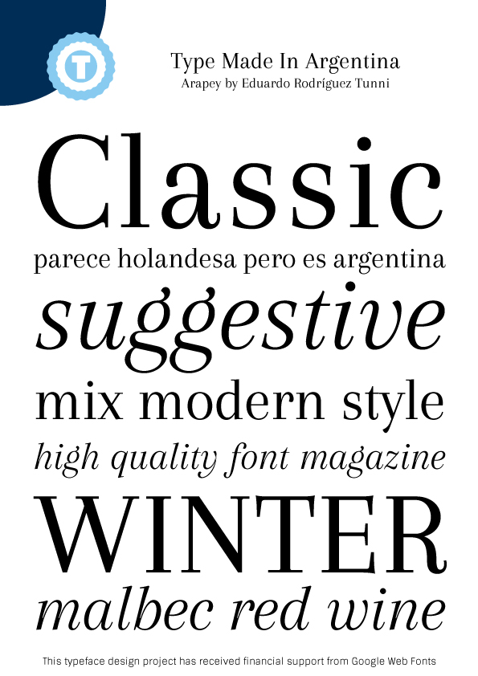

# Arapey Legacy Fonts

Arapey (Ah-ra-pay) is a contemporary modern typeface with some features of a Bodoni, but the structures, soft lines, and finishes leave a calm and distinguished feeling.
The first sketches were made during a vacation in Arapey, a small town the north of Uruguay.
The italics are gentle, rhythmic, and bring a special glamour to both text use and titles.

This folder contains the legacy files, a pair of Roman and Italic styles, developed in 2011 and extended to a Google Latin Plus glyph set in 2017. 

### Designer

* Eduardo Rodríguez Tunni

### License

Licensed under the [SIL Open Font License, 1.1](http://scripts.sil.org/OFL); you may only use these files in compliance with the License.

To contribute to the project, file an issue at <https://github.com/etunni/Arapey> or contact Eduardo Rodríguez Tunni directly at <edu@tipo.net.ar>
